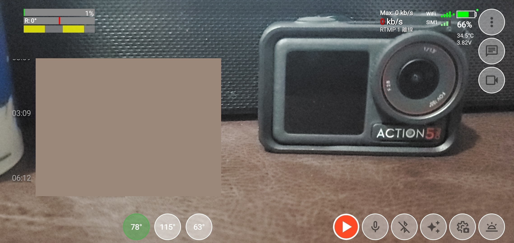
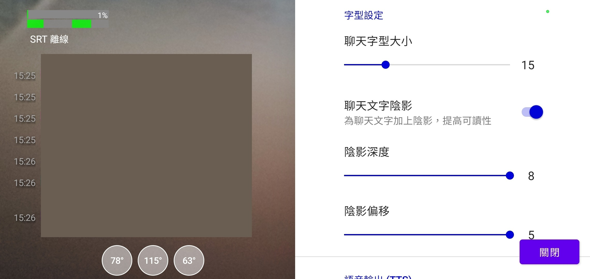

Live Streaming Camera

一個使用 [StreamPack boilerplate](https://github.com/ThibaultBee/StreamPack-boilerplate) 作底層製作的Android直播程式。

## 功能

- ✔️ RTMP 推流直播，Twitch 直接推流。
- ✔️ SRT 推流直播。
- ✔️ Twitch 聊天室、直播人數、直播時間。
- ✔️ 藍牙耳機連線。

## 更多可能加入功能

- ❌ 錄影影片儲存到手機記憶體
- ❌ 拍攝照片
- ❌ OBS控制器?

## 安裝方法
我會在 [GitHub releases](https://github.com/kongjjj/Live-Streaming-Camera/releases) 內發布 .apk 檔案。

可以在手機上開啟 GitHub 發行頁面，下載 .apk 檔案並安裝。
